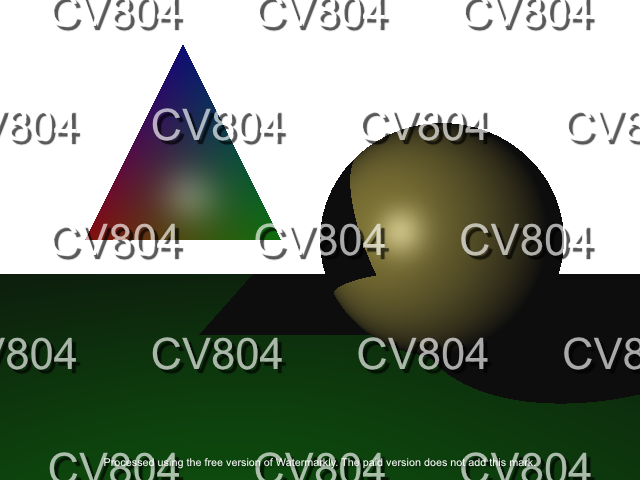

# Assignment #4
## Introduction
In this assignment, you will be building a ray tracer. Your ray tracer will be able to handle opaque surfaces with lighting and shadows. Provided for you will be starter code that will load scene data from a file.

For this assignment, we will write our own renderer based on ray tracing. That means you will have to reimplement your own rendering framework which should include camera manipulation, lighting, basic primitives, and rendering pipeline (But do not worry, this starter code will make your life much more easy).

After completing this assignment, you should have a solid understanding of:
- How to manually deal with the camera manipulation (extrinsics/intrinsics).
- How to implement Phong Illumination.
- How to implement geometric operators, e.g. calculating intersections, reflections, barycentric coordinates etc.
- How to use shadow rays to simulate shadowing.

Similar to the previous assignment, this homework is pretty challenging (and fun!). Therefore, we advise to start early and seek for helps from TAs if you have any issue. **DO NOT** wait until the very end of the deadline and request for extention. There will be no extention and your score will be deducted.

## Installing Dependencies
The only additional library used in this assignment is OpenCV, which is already installed in previous homeworks. If you haven't installed it on your machine, please refer to the instructions of previous assignments.

## Compile and Run Your Code
To compile the code, use the following script:
```
mkdir build
cd build
cmake ..
make
```

After compiling, you can render a scene and show the result to the screen, for example `./scenes_data/test_single_sphere.scene`, by running:
```
./assign4 ../scenes_data/test_single_sphere.scene
```

Or you can save the result by giving the execution file a second argument:
```
./assign4 ../scenes_data/test_single_sphere.scene ./results/test_single_sphere.png
```

You will have to render all the scenes given in `./scenes_data`. You can run the above script for each scene file, or you can use the automated script `run.sh` that we provided. All the results will be saved in `./results`

## Tasks
The ultimate goal is to build a ray tracer. To do so, your task can be divided into four steps:
- **Step 1:** Uniformly send out rays from the camera location. Since the camera does not have to move, you can assume that its location is (0,0,0). You should use backwards ray tracing where rays are sent from the camera, one ray per pixel. The final images should be 640x480, but for debugging you should use smaller resolutions with faster rendering times. For example, if you halve each dimension, you would send out 1/4th of the number of rays. You can use the field of view of 60 degrees.

- **Step 2:** Write the intersection code. The mathematical solutions for the intersection code are provided in the lecture notes or in the instructions pdf attached to this repo.

- **Step 3:** Implement the Phong illumination equations. At each intersection point, you need to first determine if it is in shadow, separately for each light source. You do this by launching a shadow ray to each of the lights. If the point is in shadow, its color with respect to that light should be (0,0,0), that is, black. If the point is not in shadow, use Phong shading to determine the color of the point with respect to that light:

    $I = C_a + C_l * \left(k_d (L \cdot N) + k_s (R \cdot V)^{sh}\right)$

    where:
    - C_a is the ambient light;
    - C_l is the color of the light source;
    - k_d and k_s are the the diffuse and specular reflection constants, respectively;
    - L is the direction vector from the point on the surface toward the light source;
    - N is the normal vector on the surface;
    - V is the direction vector from the surface to the camera;
    - R is the reflected vector of L at the point on the surface.

    The final color of the point is the sum of the contributions from all lights, plus the global ambient color. You only add the global ambient color once, regardless of how many lights the scene has, and regardless of how many lights are visible from the point. Note that it could happen that a point is in shadow with respect to all lights. In this case, the final color will be the global ambient color. Or a point could be in shadow with respect to some lights, but not others. Or, all lights may be visible from a point. If the final color is greater than 1.0, you should of course clamp it to 1.0.

    In order to compute I, you must determine the normal N at the intersection point. For triangles, you should interpolate the x,y,z coordinates of the normals given at each vertex, and then normalize the length. Use barycentric coordinates for interpolation of triangles. You should interpolate not just the normals, but also diffuse, specular and shininess coefficients. For spheres, the normal is simple to calculate based on the center of the sphere and the point location.

- **Step 4:** Create still images showing off your ray tracer. We already written the code for you. You just need to run `./run.sh` to render all the provided scenes in `./scenes_data`. You can also run the compiled code without providing the second argument (the save path) to show the image to the screen when you are debugging the code. But you will have to submit the rendered images along with code in the end.

This is the list of requirements for this assignment:
- Triangle intersection (20 points)
- Sphere intersection (20 points)
- Triangle Phong shading (15 points)
- Sphere Phong shading (15 points)
- Shadows rays (15 points)
- Still images (15 points)

After you implemented all the required functionalities, your output should look similar to the following image (without the watermarks of course):



You can also implmenent some extra features to get credit scores. Below are some suggestions (but not limited to):
- Recursive reflection (10 points)
- Good antialiasing (10 points)
- Soft shadows (10 points)
- Animation (5 points)
- Animation + Motion blur (15 points)

For recursive reflection, you need to call your ray tracer recursively. Of course, you still need to fire the shadow rays and compute a local Phong color, exactly as in non-recursive ray tracing described above. The final color should equal (1 - ks) * localPhongColor + ks * colorOfReflectedRay.

Please note that the amount of extra credit awarded will not exceed 20% of the assignment's total value.


## Starter Code Instructions
Similar to previous assignments, we also provide a starter code which already implemented a few basic elements:

- `include/vec3d.h` and `src/vec3d.cpp`: `Vec3d` class represents 3D double vector. It already has most of basic vector operators (e.g. dot product, cross product, normalization, etc). Note that different from previous homeworks, we use double instead of float for this implementation since we do not really care about performance. You don't have to implement anything in these files.
- `include/matrix.h` and `src/matrix.cpp`: Similar to Vec3d, `Matrix` class represents double matrix. Most basic operators are implemented. You don't have to implement anything in these files.
- `include/scene.h` and `src/scene.cpp`: The class represents your whole scene, which includes all the primtives, light sources, and the camera. You have to implement two functions:
    -  `Scene::get_ray_color(Ray)`: This function calculates the closest intersection of the ray and primitives. 
    -  `Scene::get_ray_color(Ray)`: This function calculates the color of the the ray using Phong illumination model. 
- `include/scene_reader.h` and `src/scene_reader.cpp`: `SceneReader` provide functions to load scene data from an input file, which includes primitives (spheres and triangles), the ambient light, and the light sources. You do not need to implement anything in these two files.
- `include/primitives.h` and `src/primitives.cpp` contains all implementations of the primitives. You have to implement the following functions:
    - `Ray::get_sphere_intersection(sphere)`: This function calculates the closest intersection of the ray with the sphere.
    - `MyTriangle::get_barycentric_coordinate(Vec3d)`: This function calculates the barycentric coordinates of the input point with respect to the triangle.
    - `MyTriangle::get_vertex_illumination(Vec3d)`: Interpolate normal, diffuse, specular, etc using barycentric coordinates.
    - `Ray::get_triangle_intersection(triangle)`: This function calculates the closest intersection of the ray with the triangle.
- `include/light.h` and `src/light.cpp`: Lighting class represents the lighting sources. You have to implement the `phong_shading` function that calculate the color of the input ray, intersected at the input vertex with respect to the light source.
- `include/camera.h` and `src/camera.cpp`: Camera class represents your camera (eye). You have to implement the followings:
    -  `Camera::shoot_rays`: This function generates rays given the extrinsics and intrinsics matrices of the camera.
    - `Camera::lookat`: Create extrinsics matrix from the eye position, look-at position, and up vector.


## Free Tips
- Check carefully the provided starter code. We already implemented almost every basic stuff so you should not waste your time reinventing the wheel.
- Check the hints given in the code, could be very useful.
- Small window size is good for debugging.
- We provided a few scenes for debugging purpose. For example, you can try to make the code work with `test_single_sphere.scene` first to make sure your sphere Phong shading is correct. Then you can move to `test_double_sphere.scene` to verify that your code works with more than two objects. The next one you should try is `test_triangle.scene` to debug your Triangle Phong shading implementation.
- Normal for ray-plane intersection: The scene file provides a normal for every triangle vertex. However, those normals should NOT be used for ray-triangle intersection. For the intersection calculation, you need to compute the normal of the plane containing the triangle. You do so by taking a cross product of two edges.
- The vertex normals provided in the scene file must be used for Phong shading. You must interpolate the vertex normals given in the scene file to the specific location of the ray-triangle intersection (using barycentric coordinates). You then use the resulting interpolated normal N in the shading equation (also to compute R). This will give smooth specular highlights.
- If the angle between the view vector (V) and the reflected vector (R) is greater than 90 degrees, R dot V will be negative. In this case, the deviation between the reflection direction and the view direction is huge, i.e., we are very far from that case where the reflected and view direction nearly align and where we get specular highlights. So, there is no specular reflection in this case, and we can just clamp R dot V to zero. Similarly for the diffuse component. If L dot N < 0, the light is below the horizon, so we clamp L dot N to 0.
- Be carefull with floating point error. For example, you should not do `a == 0` but instead `abs(a) <= _EPS` with `_EPS` is an adequately small constant.


## Show People What You Got!!!
Try to create your own scene, or add animation as in extra credit section. We will showcase your results in front of the class.
