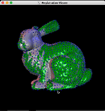

# Assignment #5
## Introduction
In this assignment, you will build a rigid surface registration applications that can register multiple input meshes interactively. After completing this assignment, you should have a solid understanding of basic surface registration alogrithms including point-to-point and point-to-plane distance minimization.

A complete implementation should look similar to the below example when running on the first four bunny meshes:



The GUI supports many functionalities:
- Register the source mesh (the green mesh): When clicking `r` or `SPACE`, the application will register the source mesh using point-to-point or point-to-plane algorithm respectively.
- Initialize the registration interatively: User can provide initial registration by holding `SHIFT` and use mouse control to manually rotate the source mesh.
- Load the next mesh: Clicking `n` will move to the next mesh to register.
- The sampled points on the source mesh are visualized by blue dots.

## Installing Dependencies
This assignment requires a few additional libraries including OpenMesh, OpenGL, and FreeGLUT, which are already installed in the second homework. If you haven't installed them on your machine, check [here](https://github.com/MBZUAI-Metaverse/CV804-starter-code/tree/main/assign2#installing-dependencies).

## Compile and Run Your Code
To compile the code, use the following script:
```
mkdir build
cd build
cmake ..
make
```

After compiling, you can start the GUI by running:
```
./aslign5 save_path path_to_mesh_1 path_to_mesh_2 ... path_to_mesh_n 
```
where `save_path` is the path to the folder that you want to save the result and `path_to_mesh_i` is the path to the $i^{th}$ mesh. Note that the program requires at least two paths as input, otherwise it will raise an error.

You will have to align all the 10 bunny meshes given in `./data` and submit the output file which is saved in `save_path`.

## Tasks
In this assignment, your task is to implement two basic surface registration algorithms: point-to-point and point-to-plane distance minimization. This can be divided into the following small steps:
- **Step 1:** Both point-to-point and point-to-plane algorithms require a set of matching points to perform an optimization step. Therefore, the first step of both methods is to sample a set of points on the source mesh (the moving mesh) and then find their closest point on the target mesh (the static mesh). In the starter code, we already implemented the closest point matching using Kd Tree so you only need to implement the source point sampling part. Your sampling algorithm must ensure that the avearage distance between every two sampled points are roughly equal to `subsampleRadius` which is defined in the code. This constraint will limit the number of sampled points and as a result improve the speed of the later optimization process.

- **Step 2:** The selected pairs could be noisy and consequently hurt the optimization. In this step, you will reject the bad pairs based on the following criterias:
    - **Distance thresholding:** If the two matched points are too far to each other, they could be just noise and need to be removed. In the starter code, the threshold is fixed as the median of all the distances of the pairs multiplied by 3.
    - **Normal Compatibility**: If the angle between the normals at the two matched points are too big (for example, more than 60 degree), the pair is possibly a noise and needed to be rejected.
    - **Matchted points at the border**: If one of the point in the pair is on the border of the target mesh, the pair should also be rejected. This criteria is already implemented in the starter code.
 
- **Step 3:** Given the matched pairs, the point-to-point algorithm register two surfaces by iteratively solving for the rigid transformation that minimize the distance between the pairs. Specifically, let $(p_1, q_1), (p_2, q_2), ..., (p_n, q_n)$ be the matched pairs, then the algorithm can be formulated as:

    $$
    \begin{align}
    R^*, t^* = \argmin_{R, t} \sum_{i=1}^n \|Rp_i +t - q_i\|
    \end{align}
    $$

    Decomposing R as three rotation matrices:
    $$
    R_x(\alpha) = \begin{bmatrix}
        1 & 0 & 0 \\
        0 & \cos \alpha & -\sin \alpha \\
        0 & \sin \alpha & \cos \alpha
    \end{bmatrix}
    $$
    $$
    R_y(\beta) = \begin{bmatrix}
    \cos(\beta) & 0 & \sin\beta \\
    0 & 1 & 0 \\
    -\sin\beta & 0 & \cos\beta
    \end{bmatrix}
    R_z(\gamma) = \begin{bmatrix}
    \cos(\gamma) & 0 & -\sin\gamma \\
    \sin\gamma & \cos\gamma & 0 \\
    0 & 0 & 1
    \end{bmatrix}
    $$

    $$
    R = R_z(\gamma) R_y(\beta) R_x(\alpha) = \begin{bmatrix}
    c_\gamma c_\beta & -c_\alpha s_\gamma + c_\gamma s_\beta s_\alpha & s_\gamma s_\alpha + c_\gamma c_\alpha s_\beta \\
    c_\beta s_\gamma & c_\gamma c_\alpha + s_\gamma s_\beta s_\alpha & c_\alpha s_\gamma s_\beta - c_\gamma s_\alpha \\
    -s_\beta & c_\beta s_\alpha & c_\beta c_\alpha 
    \end{bmatrix}
    $$

    As can be seen from the formula of $R$, finding $R^*$ and $t^*$ is a non-linear optimization task. To linearize it, we can assume that for each iteration, there exists a small rotation that brings the source points closer to the target points, i.e. $\alpha, \beta, \gamma$ is small. With this assumption, we can linearize $\sin$ and $\cos$ by approximating them as follow:
    $$
    \begin{align*}
    c_\alpha = \cos \alpha \approx 1 \\
    s_\alpha = \sin \alpha \approx \alpha \\
    s_x s_y \approx 0
    \end{align*}
    $$

    Using the above approximation, we can rewrite $R$ as:
    $$
    R = \begin{bmatrix}
    1 & -\gamma & \beta \\
    \gamma & 1 & -\alpha \\
    -\beta & \alpha & 1
    \end{bmatrix}
    $$

    Now we can convert the original optimization of $R$ and $t$ into solving for $x$ that minimize 

    $$
    \begin{align}
    E = \|Ax - b\|
    \end{align}
    $$
    where $x = [\alpha \quad \beta \quad \gamma \quad t_x \quad t_y \quad t_z]$. We already provide the solver for $x$ so your only remaining task is to build $A$ and $b$ by plugging the linear form of $R$ to (1).

- **Step 4:** In point-to-plane optimization, as suggested by the name, we will minimize the distance between the source points with the tangent planes at their corresponding matched points. The optimization task is quite similar:

    $$
    \begin{align}
    R^*, t^* = \argmin_{R, t} \sum_{i=1}^n \|n_i^T\left(Rp_i +t - q_i\right)\|
    \end{align}
    $$

    You can follow the procedure in the point-to-point algorithm to derive the formula.

## Starter Code Instructions
Similar to previous assignments, we also provide a starter code which already implemented a few basic elements:
- All the GUI-related functionalities are already implemented. Please refer to the introduction section to know what does the GUI support.
- Basic operations for matrix and vector are implemented in `matrix.h` and `vector.h`.
- Basic operators for rigid transformation (rotation and translation) are provided in `transformation.h`
- Kd tree implementation is given in `ANN/*`. You do not need to read the code but we encourage you to understand the implementation.
- Your first task is to implement the source point sampling in `RegistrationViewer::subsample`. You need to uniformly sample points on the input mesh such that the average distance of the points are approximately equal to `subsampleRadius`.
- Rejecting bad pairs need to be implemented in `RegistrationViewer::calculate_correspondences`. Note that we already remove border pairs, you only need to implement distance thresholding and normal compatibility criterias.
- Put your implementation for point-to-point distance minimization in `Registration::register_point2point`. By setting the derivative of (2) to zero, we know that the optimal value of $x$ is the solution of the overdetermined linear system $A^TAx = A^Tb$. You only need to setup $A$ and $b$. The solver is already provided.
- Similarly, you need to implement the point-to-plane minimization in `Registration::register_point2plane`.


## Free Tips
- To uniformly sample points efficiently, you can leverage the fact that consecutive vertices of the mesh are usually close in the 3D space.
- You can use `nth_element` function to efficiently find the median.
- Please contact the TAs if you stuck somewhere.


## Show People What You Got!!!
There are rooms for creativity in this assignment. For example, you can create your own mesh, or improve the algorithms. We will showcase your results in front of the class.
