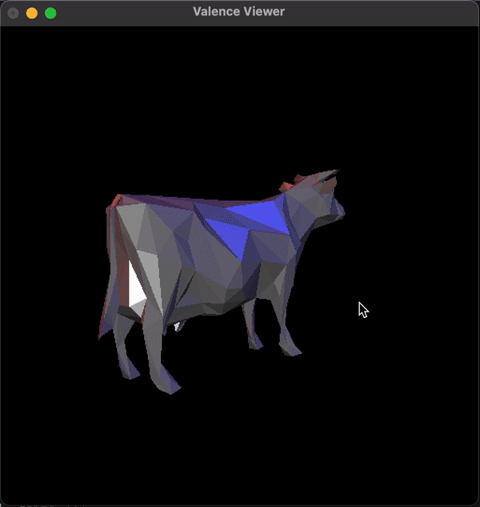

# Assignment #7
## Introduction
In this assignment, you will implement the iterative mesh decimation (or mesh simplification) using Quadric Error Metrics [Garland, Heckbert 97]. Your complete implementation should have the following output when running on the given mesh with 10% vertices are kept:



The GUI is the same as the previous homework. You can render the mesh with different modes which are listed when you right-click at the window.

## Installing Dependencies
This assignment requires a few additional libraries including OpenMesh, OpenGL, and FreeGLUT, which are already installed in the second homework. If you haven't installed them on your machine, check [here](https://github.com/MBZUAI-Metaverse/CV804-starter-code/tree/main/assign2#installing-dependencies).

## Compile and Run Your Code
To compile the code, use the following script:
```
mkdir build
cd build
cmake ..
make
```

After compiling, you can run the mesh decimation using:
```
./bin/decimation percentage input_mesh_path output_mesh_path
```
where `percentage` is the percentage of the number of vertices that you want to keep after decimation. It takes value from 0 to 1. `input_mesh_path` and `output_mesh_path` are the paths to the input and output meshes, respectively. For example, if you run the following command:
```
./bin/decimation 0.1 data/cow.off output_meshes/cow.off
```
A new mesh with only 10% number of vertices will be saved at `output_meshes/cow.off`. To view the mesh you created, use the following script:
```
./bin/viewer output_meshes/cow.off
```
If your implementation is correct, your output should be similar the above figure.

## Algorithm Overview
The ultimate goal of mesh decimation is to approximate the input mesh $M$ so that the new mesh $M'$ has number of vertices, edges, and faces while still has the same overall shape as the original mesh. In this homework, we will implement a simpler version of edge contracting algorithm using quadric error metrics proposed in [Garland, Heckbert, 97].

First, we denote the edge contraction in which two vertices $v_1$ and $v_2$ are collapsed into $v$ as $(v_1, v_2) \rightarrow v$. Assuming we are collapsing $v_1$ and $v_2$, then the ideal position of $v$ will minimize:
```math
    v^* = \underset{v}{\text{argmin}} \sum_{q \in planes(v_1)} \text{dist}(v, q)^2 + \sum_{q \in planes(v_2)} \text{dist}(v, q)^2
```
where $planes(u)$ are all neighboring planes of the vertex $u$ in the mesh. Using the parameterized form of a plane $q = [a, b, c, d]$ (assuming $[a, b, c]$ is normalized), we can rewrite the distance from $v$ to the plane $q$ as:
```math
    \text{dist}(v, q)^2 = (q^Tv)^2 = p^T(qq^T)p = p^TQp
```
Therefore the optimization can be reformulated as:
```math
    v^* = \underset{v}{\text{argmin}} \left(v^TQ_{v_1}v + v^TQ_{v_2}v\right) \\
        = \underset{v}{\text{argmin}} \left(v^T(Q_{v_1} + Q_{v_2})v\right) (1)
```
where $Q_{v_i} = \sum_{q \in planes(v_i)} qq^T$.

To simplify the task, we assume that for an edge collapsing operator $(v_1, v_2) \rightarrow v$, $v_1$ and $v_2$ are adjacent vertices and $v$ can only be either $v_1$ and $v_2$. Then we can see that each collapsing operator can be assigned to an half-edge. For example, the half-edges $(v_1, v_2)$ and $(v_2, v_1)$ can be viewed as the edge collapsing operator $(v_1, v_2) \rightarrow v_2$ and $(v_1, v_2) \rightarrow v_1$, respectively. Also, using equation (1), the cost for edge collapsing operator $(v_1, v_2) \rightarrow v_2$ is $C(v_1, v_2) = v_2^T(Q_{v_1} + Q_{v_2})v_2$. Now we can derived an efficient alorithm to decimate the given mesh $M$:
- Calculate $Q_{v_i}$ for $v_i$ in the mesh.
- Build a min priority queue using the cost $C$ as the priority.
- Repeat the following steps until the number remaining vertices reached the desired simplicity:
    - Pick the half-edge $(v_1, v_2)$ with the smallest cost $C(v_1, v_2)$. This can be done efficiently using the priority queue.
    - Check if the collapsing operator $(v_1, v_2) \rightarrow v_2$ is legal. That is, whether collapsing this pair would violate the manifold contraint, create degraded triangle, or flip the normal vector of a triangle. If it is not , remove this half-edge from the priority queue.
    - If the half-edge is legal, perform collapsing. Update the cost values of the new vertex and its neighbouring vertices. Then update the priority queue.

For more details, please refer to [this paper](https://www.cs.cmu.edu/~./garland/Papers/quadrics.pdf).
 

## Tasks
In this assignment, your task is to implement the above algorithm. This section will guide you how to implement each step of the algorithm using the starter code.
- **Task 1: Initialization.** Firstly, you need to compute the error quadrics $Q_{v_i}$ for every vertices $v_i$ in the mesh. The error quadrics of all vertices are only calculated once and you need to implement it in the `init` function. You can use the `Quadricd::Quadricd(a, b, c, d)` class to calculate the error quadrics matrix given the parameterized plane.

- **Task 2: Valid Edge Testing.** Not all edges are good for collapsing. Some edges when collapesd can violate the manifold constraint, create degraded triangles, and/or flip the normal of existing triangles. You need to implement this test  in the `test_collapse_legal()` function. The starter code already provided manifold contrainst and non-degraded triangle test, you task is to code the normal flipping test.

- **Task 3: Calculate the priority.** Each half-edge $(v_1, v_2)$ is assigned a cost $C(v_1, v_2)$ and this cost is used as a priority in the priority for efficient edge query operation later. Your task is to implement the function `priority()` to calculate this cost.

- **Task 4: The main loop.** The final task is to implement the loop described in the algorithm overview section in the function `decimate()`.


## Free Tips
- Most mesh operators are already implemented. Make sure that you are not reinventing the wheel which can make your code more complicated.
- This homework is very challenging if you are not familiar with OpenMesh. If you are stuck somewhere, seek help from the TAs.


## Extra Credits
There are a few advance tricks that you can implement and earn extra credits for this homework. For example, $v$ can be more optimal other than beging either $v_1$ and $v_2$, or applying smoothing techniques onto the output mesh. The extra credit is up to 20% of the score of the homework.

